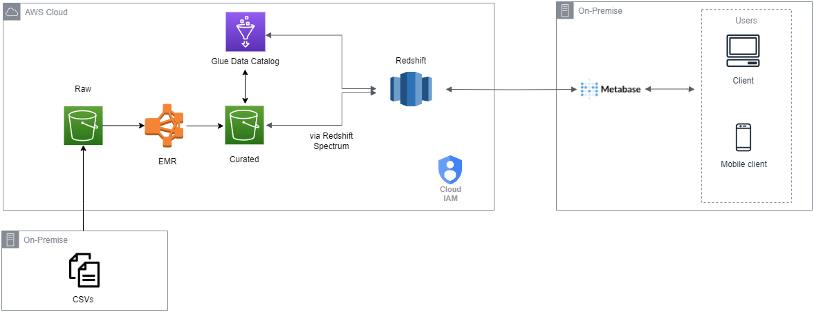

# Projeto - Transações de Cartões

O projeto se trata sobre a <b> Análise de dados de um case de transações de cartões nos EUA entre os anos de 1991 e fevereiro de 2020. </b>

O principal objetivo desse projeto é entender melhor o perfil da pessoa que efetuou a transação e quais possíveis variáveis podem ser determinantes para buscar um perfil que tenha sofrido alguma fraude durante os anos.

Ao todo, o projeto foi separado em <b> 3 fases: </b>
<li> Arquitetura dos dados </li>
<li> Entendimento e Processamento dos Dados </li>
<li> Análise dos Dados</li>

## Arquitetura dos Dados

Nessa etapa, o objetivo foi desenhar a arquitetura, isto é, o caminho pelo qual os dados partiriam desde o computador até a disponibilização para a ferramenta de visualização de dados. Abaixo, pode-se observar o desenho dessa arquitetura:

<li> Tudo se inicia com o download dos dados do case <a href="#">Card Transaction no Kaggle</a>. </li> 

<li>Após isso, os dados são inseridos em um bucket, chamado de Raw, no <b>S3</b> dentro da AWS. Esses dados chegarão brutos, em .csv, e serão processados pelo <b>EMR</b> (Elastic Map Reduce) e serão salvos em .parquet em outro bucket no <b>S3</b>, chamado de Curated.</li> 

<li>A partir desse dado em .parquet, haverá um acionamento de um crawler no <b>Glue</b>, responsável por entender a estrutura e o tipo dos dados, para catalogar como esses dados estão dispostos no arquivo e qual é o formato de cada uma das colunas. </li> 

<li>Seguindo o caminho dos dados até a visualização, faz-se necessária a utilização do <b>Redshift Spectrum</b>, que permite a leitura de arquivos no <b>S3</b> pelo <b>Redshift</b> ao se criarem schemas e tabelas externas, com o auxílio do catálogo prévio do <b>Glue</b>. A partir desse processo, os dados que foram catalogados no <b>Glue</b> e estão presentes no <b>S3</b>, podem ser lidos e disponibilizados no <b>RedShift</b>.</li> 

<li>Por último, a ferramenta de visualização escolhida foi o <b>Metabase</b>, pelo fato de ser open source e trabalhar com o <b>SQL</b>, que é uma ferramenta que também buscava desenvolver e expor. Para que o <b>Metabase</b> pudesse funcionar, foi utilizado o <b>Docker</b> e a partir da imagem metabase/metabase rodando na porta 3000 do localhost, houve a possibilidade de utilização dele. A conexão no <b>Metabase</b> é feita de maneira bastante simples, conectando ao database do <b>Redshift</b> e fazendo queries a partir dele.</li> 

Essa é uma arquitetura simples, mas cumpre o objetivo de se trabalhar quase inteiramente na nuvem, passando pelos processos de storage, processamento e disponibilização como um DW, pelo <b>Redshift</b>, até a conexão com a ferramenta de visualização, esta que poderia estar sendo utilizada num EC2, como um app no Elastic BeanStalk, numa app no Heruko, ou simplesmente na própria nuvem do <b>Metabase</b>, como seria o caso de uma versão online paga para o <b>Power BI</b>, <b>Tableau</b> e demais.

## Entendimento e Processamento dos Dados

Esse case consiste em uma tabela única com 23 colunas, todas do tipo string, sendo: 
    <li> trip_id : o ID da viagem </li>
    <li> year : ano que ocorreu a determinada viagem </li>
    <li> month : mês que ocorreu a determinada viagem </li>
    <li> week: semana que ocorreu a determinada viagem </li>
    <li> day: dia que ocorreu a determinada viagem </li>
    <li> hour : hora que ocorreu a determinada viagem </li>
    <li> user_type: tipo de cadastro do usuário </li>
    <li> gender: gênero do usuário </li>
    <li> starttime: horário de início da viagem </li>
    <li> stoptime: horário de finalização da viagem </li>
    <li> tripduration: duração da viagem </li>
    <li> temperature: temperatura, em Fahrenheit, no momento da viagem </li>
    <li> events: tempo (clima) no momento da viagem </li>
    <li> from_station_id: ID da estação de origem </li>
    <li> from_station_name: nome da estação de origem</li>
    <li> latitude_start: latitude de origem </li>
    <li> longitude_start: longitude de origem </li>
    <li> dpcapacity_start: número de espaços para as bicicletas em cada estação de origem </li>
    <li> to_station_id: ID da estação de chegada </li>
    <li> to_station_name: nome da estação de chegada</li>
    <li> latitude_end: latitude de chegada </li>
    <li> longitude_end: longitude de chegada </li>
    <li> dpcapacity_end: número de espaços para as bicicletas em cada estação de chegada</li> 

Sabendo-se disso, a arquivo .csv, localizado no bucket Raw, foi processado no <b>EMR</b>, utilizando <b>Pyspark</b>, no Jupyter Notebook. 

Buscou-se apenas o mínimo para a possível visualização posterior, sendo verificada a existência de nulos, que comprovou que não havia nulos nessa tabela. 

Depois, houve a alteração dos tipos de dados das colunas, já que algumas deveriam ser numéricas e outras no formato de timestamp, como no caso do starttime e stoptime.  

Ao final dessa etapa, foi gerado um novo arquivo, nesse caso .parquet e ele foi salvo em outro bucket, chamado Curated.

## Análise dos Dados

Com os dados disponíveis no <b> RedShift </b>, conecta-se ao <b> Metabase </b> e o foco se vira para a análise em si. Com isso, dentre as, aproximadamente, <b> 21,5 milhões </b> com uma taxa de <b> 0,02% de fraude </b>,<b> 2000 diferentes usuários</b> e <b> 6146 cartões utilizados no deccorer dos anos</b>, alguns cruzamentos entre os dados foram realizados para bucar extrair informações relevantes, entre eles:  

<b>1 - Quantidade de usuários pela Idade Atual</b>

  

Percebe-se, através do gráfico, que a maioria dos 2000 usuários estão dispersos entre 18 e 60 anos, considerados anos de atividade laboral. Ainda, pode-se notar uma queda constante do número de usuários ao passar das idades, tendo como exceção pessoas entre 41 e 50 anos.    

<b>2 - Taxa de pessoas, que tiveram seus cartões em algum problema com fraude, pela idade atual.</b>

  

Tendo passado pela análise de idade atual, seria plausível presumir que com um maior número de usuários em idades mais baixas, o percentual de fraude deveria seguir essa proporção. Contudo, ao observar o gráfico, é possível verificar uma crescente com o aumento da idade, sendo os jovens entre 18 e 30 anos aqueles com menor percentual de fraude e aqueles acima dos 80 com maior percentual. 

Dada a leitura que o gráfico permite, é possível começar a teorizar do motivo disso ocorrer. Um dos possíveis motivos é o avanço da tecnologia e as pessoas mais idosas não conseguirem acompanhar o andamento da mesma.    

<b>3 - Taxa de Endividamento por Usuário</b>

  

Primeiramente, para o cálculo da Taxa de Endividamento foi utilizada a Dívida Total e o Ganho Anual por Pessoa, a partir disso foi calculada uma taxa tendo como base o valor da Dívida Total pelo Ganho Anual por Pessoa. Essa taxa é maior ou igual a 0, onde o valor corresponde ao percentual que a Dívida Total representa no Ganho Anual por Pessoa. Depois, ela foi separada em três categorias: baixa, média e alta. Sendo baixa, a faixa entre 0 e 0.5 (não incluso); média, a faixa entre 0.5 (incluso) e 1 (não incluso); e alta, acima de 1(incluso).

Nota-se que mais de 67% dos usuários analisados possuem alto grau de endividamento, possuindo dívidas totais que superam, e em alguns casos superam e muito, o ganho anual.   

<b>4 - Quantidade de Usuários pelo FICO Score</b> 

  

O FICO Score pode ser visto como o nosso Serasa Score, para avaliar a saúde do usuário para possíveis futuros contatos com cartão, conta ou financiamento.

No gráfico, observa-se que a grande maioria dos usuários se encontra na faixa entre 650 e 799, consideradas boas faixas de Score, sendo bem aceitas nas principais instituições de referência.    

<b>5 - Quantidade de Cartões pelo Tipo e pela Bandeira</b>

  

Constata-se que a bandeira Mastercard é a mais utilizada nas transações em geral e que, em geral, há preferência pela utilização do cartão de débito. Porém, também é possível se atentar para o fato que na categoria cartão de crédito, a bandeira Visa tem maior quantidade de cartões utilizados.   

<b>6 - Quantidade de pessoas pela Taxa de Endividamento pela Idade Atual</b>

  

É interessante notar que a interseção da taxa de endividamento com a distribuição da idade atual, no contexto dos EUA, pode-se criar uma hipótese de os mais jovens serem mais endividados por conta de possíveis financiamentos, sejam estudantis, hipotecas ou alguma linha de crédito para carro ou negócios. E dessa maneira, ao longo da vida com o desaparecimento dessas grandes dívidas, a taxa de endividamento se inverter, como é possível verificar entre as faixas de idade 51-60 e 61-70, por exemplo.   

<b>7 - Quantidade de Usuários pelo FICO Score e pela Idade Atual</b>

  

É importante frisar que mesmo com o alto endividamento dos mais jovens e por eles serem maioria, o Score em si não é afetado. Isso poderia vir a ser entendido como se o FICO Score fosse mais focado no curto prazo e nos pagamentos realizados pelos usuários, estando em dias com seus débitos atuais, mesmo com a existência de débitos passados. Com isso, haveria uma importância maior para o volume de transações com pagamentos em dia, do que uma correlação positiva com a taxa de endividamento.    

<b>8 - Soma dos Valores Gastos Reajustados por Ano</b>

  

Nesse gráfico, saí-se um pouco da perspectiva micro, do usuário, e entra um pouco mais na macroeconomia. Pelo gráfico, que foi calculado se ajustando os gastos de cada transação pelo CPI (indexador de inflação dos EUA, por mês e por ano), é possível observar uma crescente entre 1991 e 2011, com o começo de uma queda suave a partir de 2011 até 2019, não foi utilizado o ano de 2020, por só existir dado de dois meses.

Essa crescente inicial poderia ter se dado pelo avanço tecnológico tanto no setor de tecnologia propriamente dito, mas com tudo que ele abarca, inclusive o financeiro, como máquinas de cartão, conta bancária digital, entre outros. Porém, a partir de 2008 com a crise financeira que eclodiu, a economia dos EUA entrou em recessão e demorou anos para se recuperar, com outros fatores externos posteriores a 2011, inclusive a insegurança da população e do setor financeiro, poderiam ter mantido a queda nos anos posteriores.   

<b>9 - Valores Totais Gastos, que tiveram seus cartões em algum problema com fraude, por Ano</b>

   

.   

## Conclusão

O projeto foi elaborado tendo a premissa de avaliar, a partir dos dados, a relação entre as utilizações, perfil e as estações, buscando entender melhor sobre possíveis melhoras em estratégias e ofertas de serviço. Para isso, foram utilizadas ferramentas, tais como <b>Pyspark, SQL, AWS, Metabase</b> para auxiliar na resposta desses questionamentos.

Após o trabalho com os dados e a análise, nota-se que o principal perfil dos usuários é de homens, inscritos, provavelmente utilizando para trabalho, entre 8-10 e 16-18, com utilizações maiores em períodos quentes (como final da primavera e verão), focados principalmente em 5 grandes estações, seja para partida ou para chegada. 

Isso ajuda a entender o usuário atual, gerar personas melhores para o marketing e pensar em possíveis políticas e estratégicas de marketing, como a decisão de focar em ganhar um volume maior de usuárias femininas ou de tentar aumentar o público em horários de menor incidência de utilização através de campanhas de marketing mais efetivas ou descontos. Por final, mas não menos importantes, uma possível estratégia de um aumento de oferta nas principais estações de partida e chegada, dados os volumes apresentados.

Com o intuito de avançar com a ideia do projeto, poderia se gerar uma discussão e avaliar alguns indicadores (KPIs) para que fossem observados ao longo do tempo e que pudessem estar disponíveis em um dashboard, que poderia ser gerado no próprio Metabase (ou outra ferramenta de visualiação).

